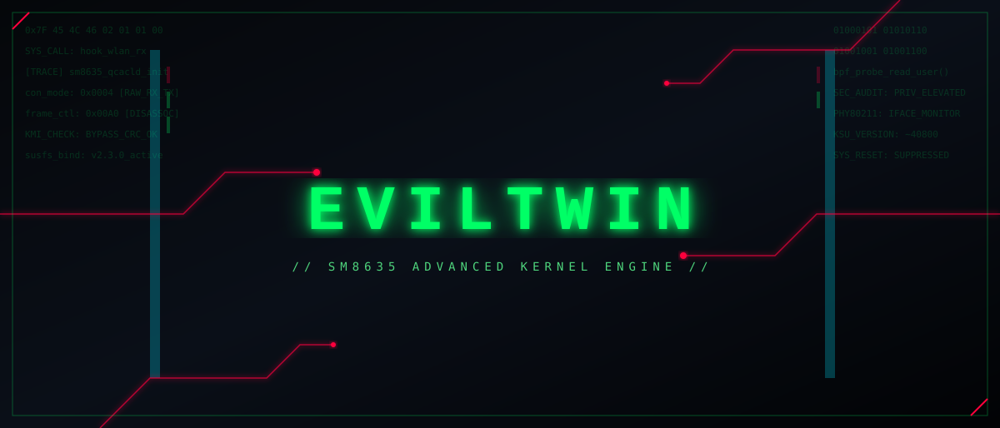

<div align="center">
  
</div>

### **EVILTWIN KERNEL // SM8635**
*Offensive Security & Low-Level Wireless Auditing Engine for Xiaomi POCO F6 / Redmi Turbo 3 (`peridot`)*

[](https://github.com/Raju-yeager/EvilTwin_kernel_xiaomi_sm8635/releases)
[](https://kernel.org)
[](https://github.com/Raju-yeager/EvilTwin_kernel_xiaomi_sm8635/releases)
[](https://gitlab.com/simonpunk/susfs4ksu)
[](LICENSE)
[]()

---

</div>

> **WARNING / DISCLAIMER**  
> **USE AT YOUR OWN RISK.** This custom kernel is provided strictly for educational purposes, authorized security auditing, and hardware research. Modifying kernel-level driver states can cause bootloops, thermal variance, or system instability. The developer assumes zero liability for bricked devices, voided warranties, or misuse.

---

## ⚡ Overview & Capabilities

**EvilTwin** is an advanced GKI 6.1 kernel build customized specifically for Qualcomm SM8635 devices (`peridot`). While standard OEM kernels stub or strip raw frame hooks, EvilTwin patches Qualcomm's `qcacld-3.0` WLAN architecture to unlock complete hardware access.

* **Native Monitor Mode:** Unlocks driver transport endpoints (`wlan0`), converting the network interface into a passive listener without external USB adapters.
* **Raw Frame Transmission:** Patches `ndo_start_xmit` hooks to transmit unencrypted 802.11 frames natively.
* **Integrated Root Stack:** Features KernelSU-Next / SukiSU-Ultra with full SUSFS v2.3.0 path, mount, and symbol hiding.
* **Native Container Support:** DroidSpaces / Rootless Docker support with namespacing preserved inside reserved KABI slots.

---

## 📥 Downloads

### [⬇ Download Latest EvilTwin Kernel Release](https://github.com/YOUR_GITHUB_USERNAME/kernel_xiaomi_sm8635/releases/latest)

---

## 🛠 Features & Configuration

### Stack Architecture

* **Wi-Fi Subsystem:** Patched `qcacld-3.0` (`qca_cld3_qca6750`) with unlocked `con_mode` hooks and direct `mac80211` translation.
* **Root Integration:** SukiSU-Ultra / KernelSU-Next with real `KSU_VERSION` reporting.
* **Hiding Engine:** SUSFS v2.3.0 covering `sus_su`, mount points, open-redirect, and cmdline spoofing.
* **Telephony & IMS:** `DEBUG_INFO_BTF` remains enabled; full VoLTE, VoNR, and Netd functionality maintained without regressions.

---

## 🚀 Installation Guide

### Prerequisites
* Unlocked Bootloader on POCO F6 / Redmi Turbo 3 (`peridot`).
* Custom Recovery installed (AERA Recovery or OrangeFox recommended).
* Backup of current `boot`, `vendor_boot`, and `init_boot` partitions.

### Flashing via Custom Recovery
1. Download the latest `EvilTwin-peridot-release.zip` from the [Releases](https://github.com//kernel_xiaomi_sm8635/releases) tab.
2. Boot into recovery (Hold **Power + Volume Up**).
3. Select **Install / Sideload**, navigate to internal storage, and pick the ZIP.
4. Swipe to flash.
5. Reboot System.

### Fastboot Method (Raw Image)
```bash
fastboot flash boot boot.img
fastboot reboot

🔧 Enabling Monitor Mode
Toggle monitor mode directly via root shell:
# Enable Monitor Mode
su
ip link set wlan0 down
echo 4 > /sys/module/qca_cld3_qca6750/parameters/con_mode
ip link set wlan0 up

# Return to Station (Managed) Mode
su
ip link set wlan0 down
echo 0 > /sys/module/qca_cld3_qca6750/parameters/con_mode
ip link set wlan0 up

<div align="center">
Built for the Offensive Security Community.
Contributions, bug submissions, and patches are welcome.
</div>
